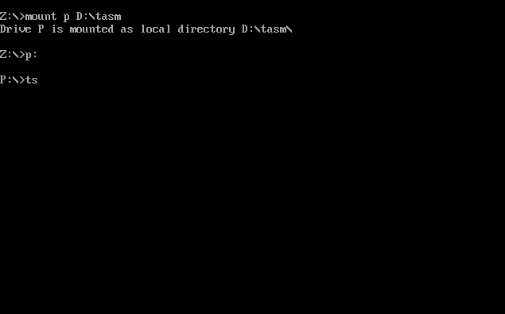
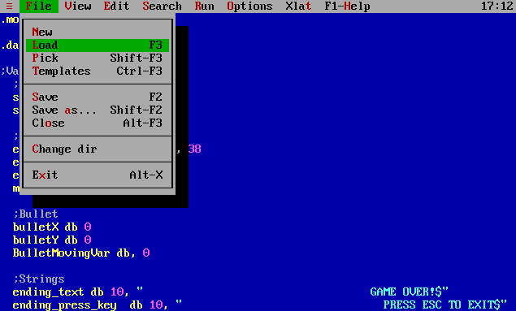
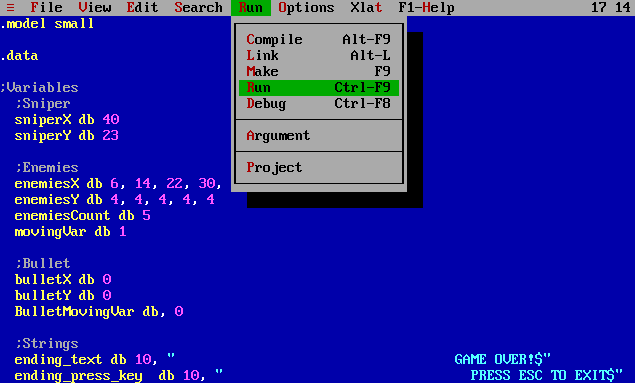
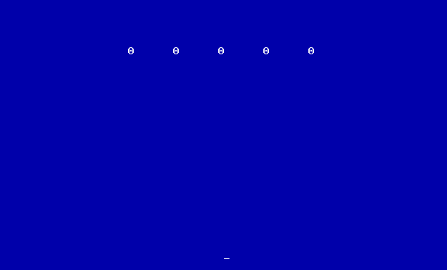
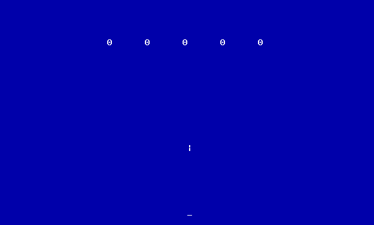
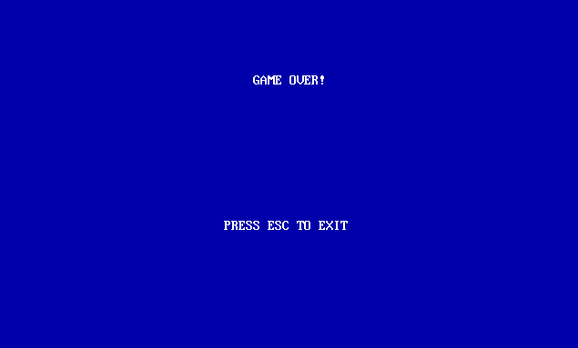

# Space Invaders
A Space Invaders game built in assembly

## Installation
- Install [DOSBox](https://www.dosbox.com/download.php?main=1)
- Move the **space_invaders.asm** file into the **tasm** folder

Open up DOSBox and type the following commands:  
**_Please note that "p" can be changed to any character_**  
```
mount p [TASM_FOLDER_PATH]
p:  
ts  
```
Next, please navigate to ***File->Load*** and choose the space_invaders.asm file.  
Then, head over to ***Run->Run*** and run the program.  

**_To navigate inside of the compiler, you need to use the arrows and the 'ALT' key_**  

## Game Information
### Terms
- Sniper - The **\_** character on the screen. Launches a bullet to kill enemies
- Bullet - The **\|** character on the screen. Launched by the sniper to kill enemies
- Enemies - The **\*** characters on the screen. Need to be killed by the sniper

### Instructions
- Left arrow - Move the **Sniper** one step to the left
- Right arrow - Move the **Sniper** one step to the right
- Space key - Launch a bullet towards the enemies above

## Screenshots






